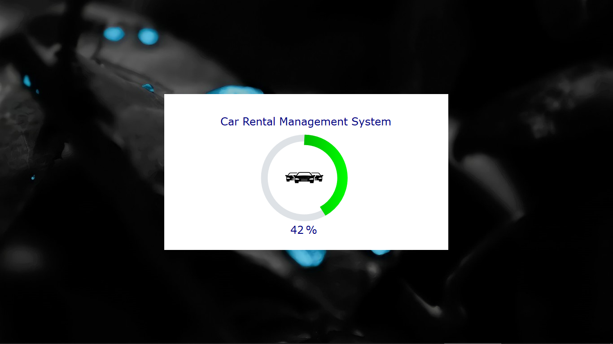
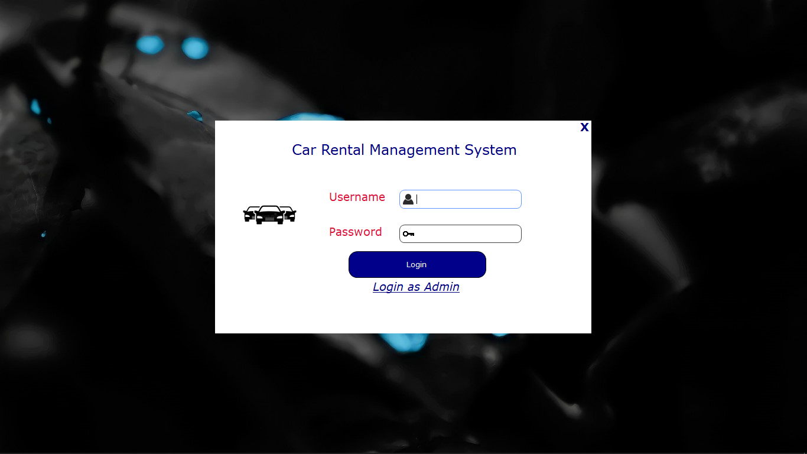
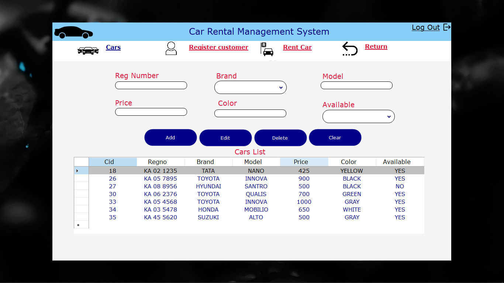
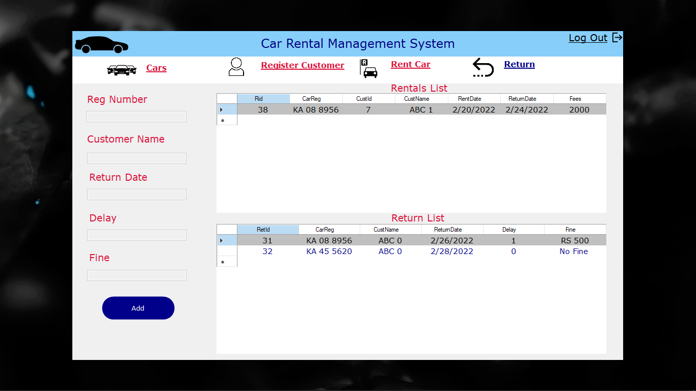
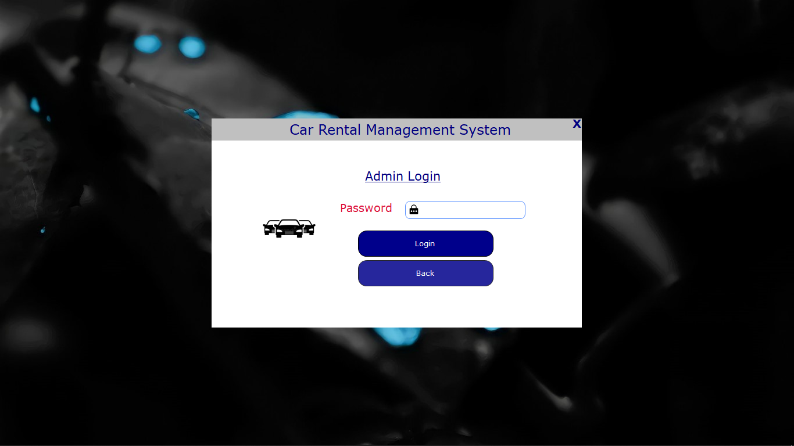

# Car Rental System

A car rental system built using Visual Basic .NET and MySQL.

## Description

This project is a car rental system that allows users to rent cars from a fleet of available vehicles. It provides functionalities to manage customer information, car registration, rental transactions, and returning rented cars. The system calculates rental fees based on the number of days a car is rented and tracks the availability of cars.

## Screenshots

  

 

  

 

  

 

  

 

  

## Forms

- Customer management
- Car registration
- Rental transactions
- Return car process
- Rental fee calculation

## Technologies Used

- Visual Basic .NET
- MySQL
- MySQL Connector/NET
- Windows Forms (for GUI)

